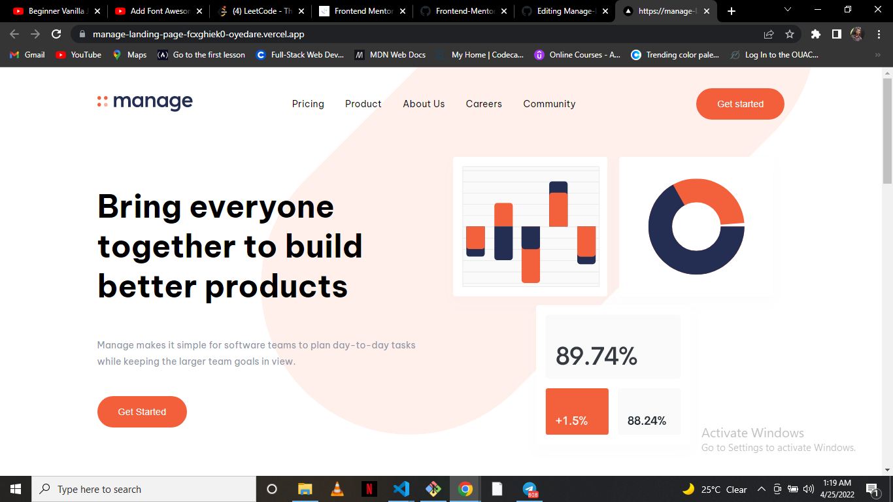

# Frontend Mentor - Manage landing page solution

This is a solution to the [Manage landing page challenge on Frontend Mentor](https://www.frontendmentor.io/challenges/manage-landing-page-SLXqC6P5). Frontend Mentor challenges help you improve your coding skills by building realistic projects. 

## Table of contents

- [Overview](#overview)
  - [Screenshot](#screenshot)
  - [Links](#links)
- [My process](#my-process)
  - [Built with](#built-with)
  - [Useful resources](#useful-resources)
- [Author](#author)

## Overview

### Screenshot

### Links

- Solution URL: [Github Repo](https://github.com/Oyedare/Manage-Landing-Page)
- Live Site URL: [Deployed site](https://manage-landing-page-fcxghiek0-oyedare.vercel.app/)

## My process

### Built with
- [Next.js](https://nextjs.org/) - React framework
- [Styled Components](https://styled-components.com/) - For styles

### Useful resources

- [Stackoverflow](https://www.stackoverflow.com) - Stackoverflow really helped in building this project, it was a run to site to get solutions to problems.
- [Next.js](https://nextjs.org/) - Next.js official website was the best place to go to read up on stuffs that i find confusing or misunderstanding on Next.
- [Styled Components](https://styled-components.com/) - For styling of the website, styled components website and github page helped in setting styled-components in Next.js project.

## Author

- Frontend Mentor - [Oyedare](https://www.frontendmentor.io/profile/Oyedare)
- Twitter - [_stephentony_](https://twitter.com/_stephentony_)
